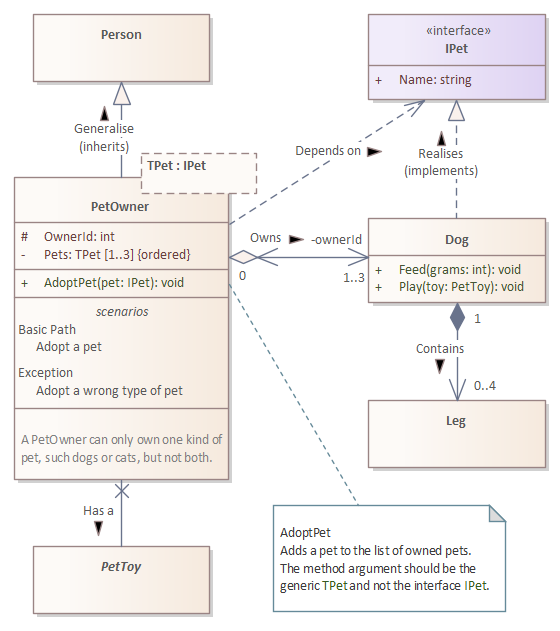

Class Diagrams
=

<!-- @import "[TOC]" {cmd="toc" depthFrom=1 depthTo=6 orderedList=false} -->
<!-- code_chunk_output -->

- [Class diagram](#class-diagram)
- [Classes](#classes)
- [Relationships](#relationships)
- [Code](#code)
- [Summary](#summary)

<!-- /code_chunk_output -->

This example class diagram shows people and their pets; specifically it shows a `PetOwner` class and it's relationship to a `Dog` class. 

> __Memory tip__
> This example class diagram contains almost everything needed to know about class diagrams.

# Class diagram



# Classes

<table>
<tr><th width="35%">Description</th><th  width="25%">Element</th><th width="35%">Code</th></tr>
<tr>
<td>

A class is represented as box, such as this `Person` class.

</td>
<td></td>
<td>

```csharp
public class Person {
}
```

</td>
</tr>
<tr>
<td>

The box can have compartments showing additional details about the class, such as these method signatures on the `Dog` class.

The `+` plus symbol indicates that these methods are `public`.

</td>
<td></td>
<td>

```csharp
public class Dog : IPet {
  // ...
  
  // Methods
  public void Feed(int grams) { }
  public void Play(PetToy toy) { }
}
```

</td>
</tr>
<tr>
<td>

An interface is drawn in the same way, but with the stereotype `interface` added to it. Stereotypes explicitly define what the element represents.

</td>
<td></td>
<td>

```csharp
public interface IPet {
  public string Name {get; set;}
}
```

</td>
</tr>
<tr>
<td>

An abstract class is shown in _italics_, and so are any abstract methods.

</td>
<td></td>
<td>

```csharp
public abstract class PetToy {
}
```

</td>
</tr>
<tr>
<td>

The box can have multiple compartments, each showing different types of details. For example the `PetOwner` class shows properties, methods, a usage scenario and notes.

The symbols:
- `#` hash indicates that the property is `protected`
- `-` minus indicates that the property is `private`
- `+` plus indicates that the method is `public`.

</td>
<td></td>
<td>

```csharp
public class PetOwner {
  // Properties
  protected int OwnerId { get; }
  private IList<PetType> Pets { get; }

  // Methods
  public void AdoptPet(IPet pet) {
    Pets.Add(pet);
  }
}
```

The implementation of `Pets` as an `IList` is not defined in the UML, instead it was a development choice. The code for this class is not yet complete.

</td>
</tr>
<tr>
<td>

By adding the generic template parameter of `TPet` to `PetOwner`, a pet owner can be limited to own only one specific type of pet.

Generics are shown in an attached dashed box at the top of the class.

</td>
<td></td>
<td>

```csharp
private static class FooHelper<TPet> where TPet : IPet {
  // ... 
}
```

</td>
</tr>
</table>

# Relationships

# Code
> __Beware__
> This code is not very good, but the succinct class diagram is very useful for understanding UML.

# Summary
